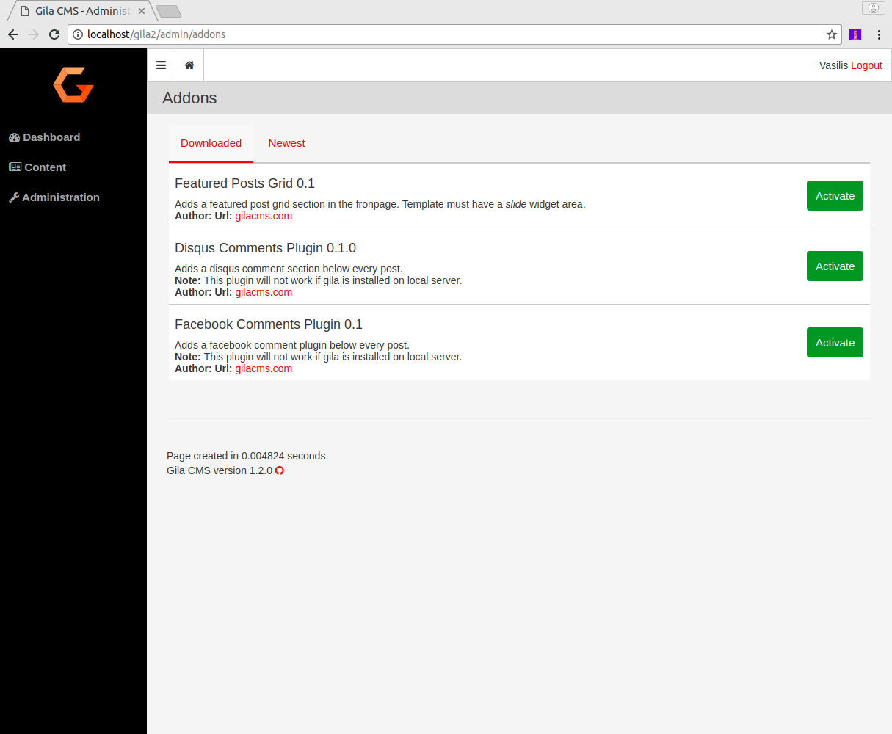
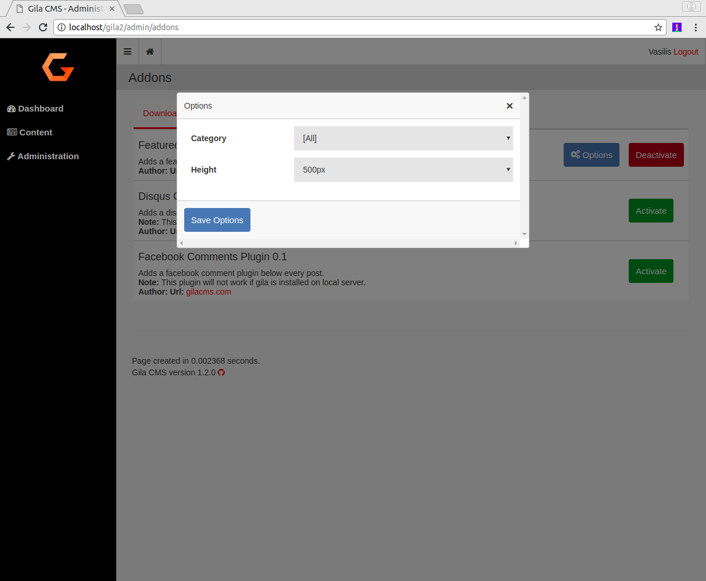

# Administration

In the administration menu you the Administration option gives a submenu of the basic administation areas

- [**Users**](#users)
- [**Widgets**](#widgets)
- [**Packages**](#packages)
- [**Themes**](#themes)
- [**Settings**](#settings)

### Users

Users are the persons that you can grand access to website and give theme privileges to create or edit content.

....Under development....

### Widgets

Widgets are some blocks that you can show them on the layout of the website and improve the user experiense of the visitors. Widgets can be for example *menus, comment sections, text blocks, lists of links*.

....Under development....

### Packages

Packages give new functionalities on your web application. They may add a specific widget, a few new links in the administration menu or add new content and new templates to show the content.
For example *Facebook Comments Plugin* add a facebook comments section below every page post. *Featured Posts Grid* show the thumbnails photos from featured posts in the front page of a blog theme.

You can administrate packages from Administration->Packages

The installed packages usually show an **Options** button. By clicking this button you can change some  parameters for the specific package. When you save the settings the changes will take effect by reloading the page.

### Themes

Themes change the look and style of your website. They use different colors and fonts and helps your visitors identify your website and improve their user experience (UX).

You can select the theme from Administration->Themes

The selected theme usually shows an **Options** button. By clicking this button you can change some  options for the theme like the header image (banner) of the website or the main color.

### Settings

On Administration->Settings page and we can make the following configurations

- **Title** is the website title. It will appear up from the menu if we don't use a banner for the template.
- **Description** is a small text that describes the website.
- **Website URL** the url path like 'www.mysite.com' or 'https://mysite.com'
- **Theme** changes the look and style of your website. You can select theme from *Administration->Themes*
- **Timezone** The dates and times saved in posts, logs and the rest of the content will be based on the selected timezone.
- **Default controller** The controller that will be used if the calling path do not provide it as first parameter. For example the **Admin** controller is used when we call mysite.com/admin but when we call *mysite.com* or *mysite.com/my-post* the default controller will be used, which is **Blog**, so these paths are egual with *mysite.com* and *mysite.com/my-post*. There is not need to change the default controller unless you want to change how the website will be used.
