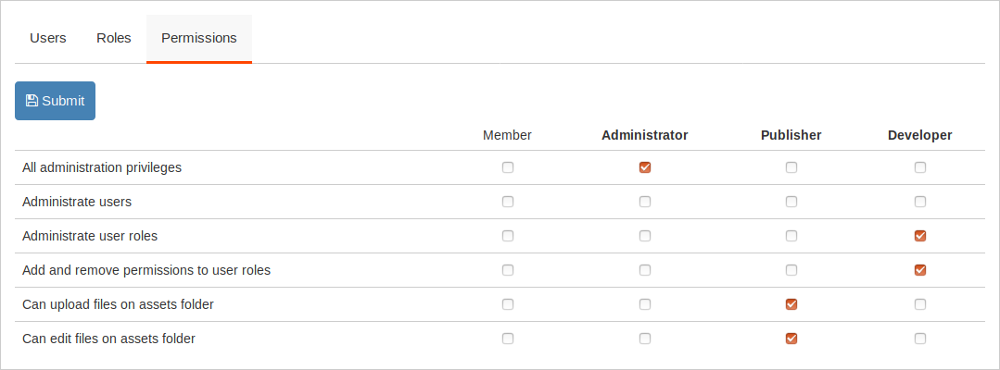

# Administration

In the administration menu you the Administration option gives a sub menu of the basic administration areas

- [**Users**](#users)
- [**Main Menu**](#main-menu)
- [**Widgets**](#widgets)
- [**Packages**](#packages)
- [**Themes**](#themes)
- [**Settings**](#settings)
- [**Logs**](#logs)
- [**DB Backups**](#db-backups)
 

## Users

Users are the persons that you can grand access to website and give them privileges to create or edit content. On *Users* tab you can add new or modify existing users.

### User Roles

On *Roles* you can add new roles for the users. Roles represent job functions and through them users acquire specific permissions.

### Permissions

On *Permissions* you can set the common permissions that all registered users can have or to specific user roles. Permissions grand to the users access to resources or perform certain operations.

 

## Main Menu
The main menu is displayed in the navigation bar of the front pages of the website. By default the menu will include a link to the home page, the post categories and the publish pages. In this area you can modify the with the menu editor.
This [video](https://www.youtube.com/watch?v=CFIQ-DWoeMY) demonstrates quickly how you can edit the menu:
 

## Widgets

Widgets are some blocks that you can show them on the layout of the website and improve the user experience of the visitors. Widgets can be for example *menus, comment sections, text blocks, lists of links*.
Every page have four values:
- **ID**: a unique identifier
- **Title**: the title of the widget
- **Type**: widget type
- **Widget Area**: is where the widget will be displayed. Can be an area in a view from the website theme or the administration.
- **Position**: the position of the widget in the widget area.
- **Active**: if the widget is visible or not.

**Notice:** When you create a new widget you can set the type of the widget, this field cannot not be changed later since it determines the widget's structure of the data.
 

## Packages

Packages give new functionalities on your web application. They may add a specific widget, a few new links in the administration menu or add new content and new templates to show the content.
For example *Facebook Comments Plugin* add a facebook comments section below every page post. *Featured Posts Grid* show the thumbnails photos from featured posts in the front page of a blog theme.

You can administrate packages from Administration->Packages

The installed packages usually show an **Options** button. By clicking this button you can change some  parameters for the specific package. When you save the settings the changes will take effect by reloading the page.

 

## Themes

Themes change the look and style of your website. They use different colors and fonts and helps your visitors identify your website and improve their user experience (UX).

You can select the theme from Administration->Themes

The selected theme usually shows an **Options** button. By clicking this button you can change some  options for the theme like the header image (logo) of the website or the main color.
 

## Settings

On Administration->Settings page and we can make the following configurations

### Basic Settings

- **Title** is the website title. It will appear up from the menu if we don't use a logo from the theme options.
- **Description** is a small text that describes the website.
- **Website URL** the url path for exmple 'https://mysite.com'
- **Admin Email** sets the email of the administration.
- **New users can register** adds the registration form for the visitors so they can register as users.
- **New users activation** How the new users are activated.
- **Theme** changes the look and style of your website. You can also change the theme from *Administration->Themes*
- **Timezone** The dates and times saved in posts, logs and the rest of the content will be based on the selected timezone.
- **Language** The language of the website and the administration menu.
- **Admin Logo** set the image to display to administration menu and login screen.
- **Favicon** set the icon for your website.

### Advanced Setting

You change these setting if you are developing or set up the installtion.

- **Use CDN** Use CDN for static files of popular libraries (jquery.js, vue.js). It's not advised for local installation where internet connection may fail.
- **Pretty Urls** turns *?c=blog&action=tag&tag=linux* into *blog/tag/linux*. If is not selected by default then your apache server may not have the *mod_rewrite* enabled.
- **Default controller** The controller that will be used if the calling path do not provide it as first parameter. For example the **Admin** controller is used when we call mysite.com/admin but when we call *mysite.com* or *mysite.com/my-post* the default controller will be used, which is **Blog**, so these paths are egual with *mysite.com* and *mysite.com/my-post*. There is not need to change the default controller unless you want to change how the website will be used.
- **Environment** If changes to *Development* the website wont use the combine *load.php* from the packages and will display all notices and errors of the back end. Must use it when you make changes in the code.
- **Check For Updates** will automatically search for new updates on packages and display alerts.
- **Use WEBP** your website will save resized images as webp images, their size is al least 10% small from jpeg or png.
- **Max Media Upload (px)** The maximum width and height of uploaded images (in pixels). If these values are set, then the uploaded images with bigger sizes will be resized. This is a way to avoid excessive use of disk space from photos.

The following settings can be set directly in *config.php* but you be careful, because they could create security issues with your website.

- **trusted_domains** An array of domains that your website will work. For example the main domain, the ip and parked domains.
- **cors** (Cross-Origin Resource Sharing) An array of domains that your website will respond in requests.
 

## Logs

In this page you can navigate inside the log files of the installation.

## DB Backups

You can create a new database backup and then download it or restore(Load) it later.

## /admin/phpinfo

This option will display the settings of the php moduls on the server. This is for informational purposes only. DO NOT share screenshots in the public of this page as it includes data about the server configuration.

## /admin/content

In this page you can see all the registered tables in your system.
