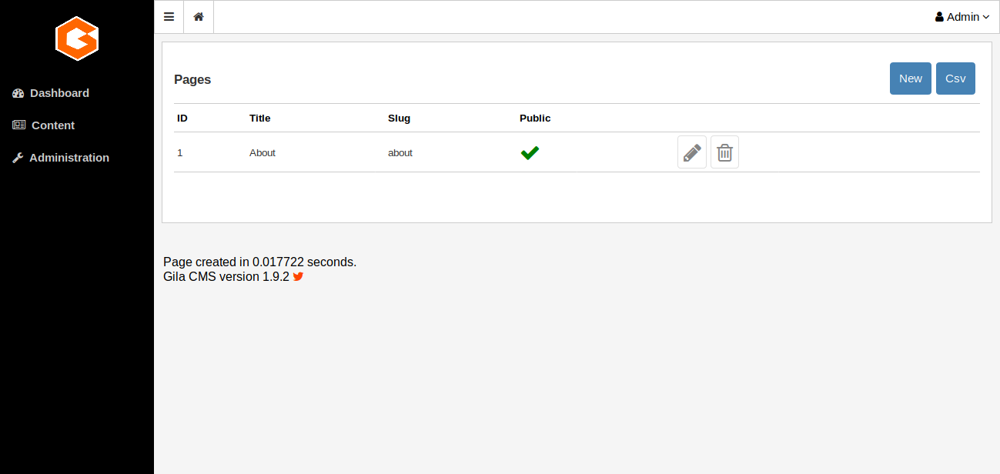
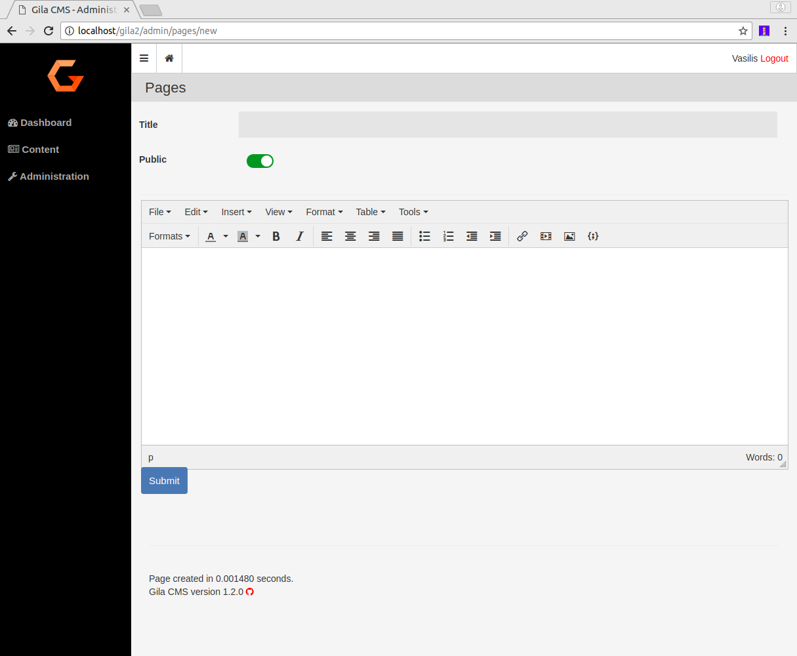
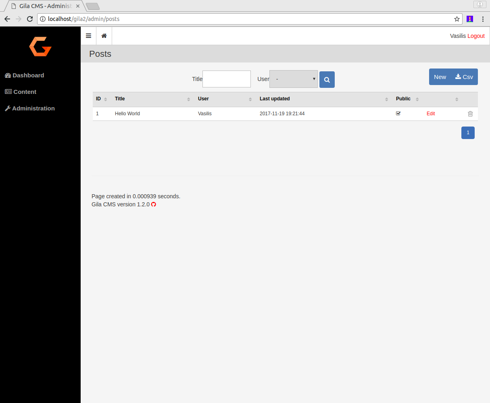
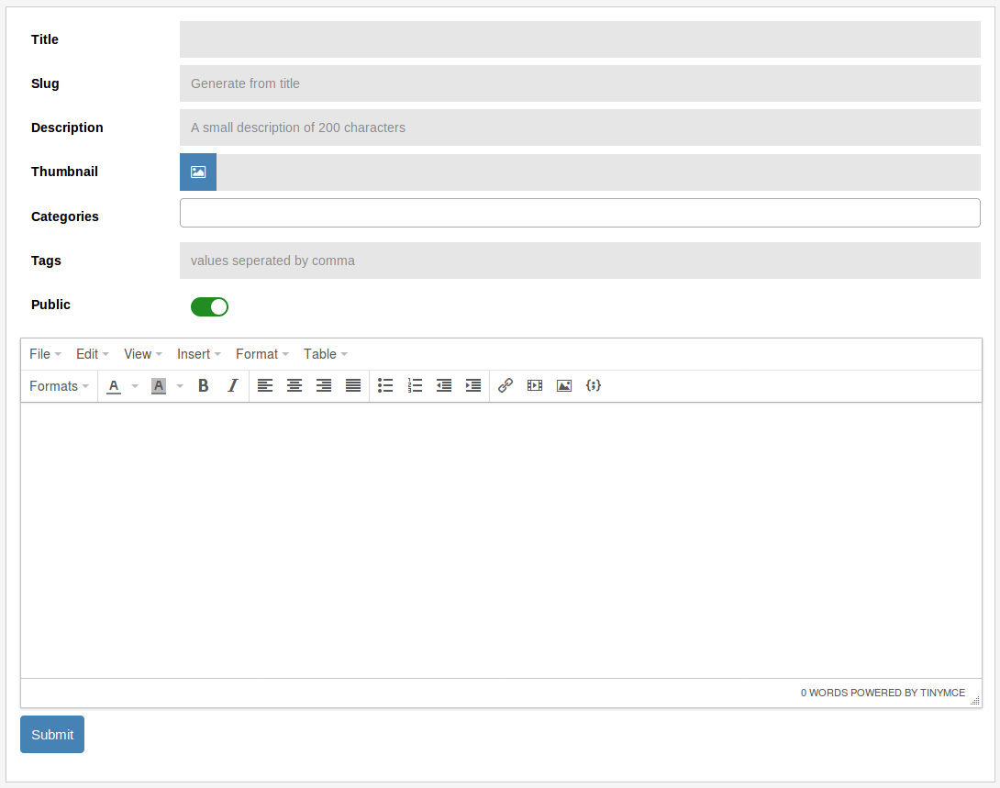
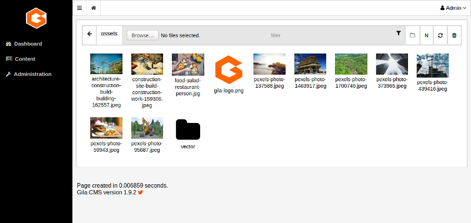

# Content

In the administration menu the Content option gives a submenu of the basic content types of Gila:

- [**Pages**](#pages)
- [**Posts**](#posts)
- [**Categories**](#categories)
- [**Media**](#media)

 
## Pages

Pages are the basic content type. A page can be just a text or have media. The information of a page is independent of time so you want them to be found by the visitor in the same place, like on the menu of the website.

Every page have four values:
- **ID**: a unique identifier
- **Title**: the title of the page
- **Slug**: is the path of the page. For example the path of a page with title 'My Page' will be *mysite.com/my-page*
- **Public**: an on/off flag. If Public value is off for 'My Page' then *mysite.com/my-page* wont be accessible from the browser.

To **create a new page** click on button **New** that you see on the up-right corner of the table.

 
## Posts

The posts can be news or articles about your business or the interests of the website. They are organized in categories and are listed in chronological order.

To **create a new post** click on button **New** that you see on the up-right corner of the table.

 
## Categories

Categories are used to categorize posts or maybe other popular content that you could use later.
You only add or edit the names of the categories.

 
## Media

Media are the images that you want to use for your posts. They are saved as files and not in the database like the other content types. The root directory of media is */assets*. The files and subfolders of */assets* are visible in the public by the path *mysite.com/assets* so you should not upload files or images that you don't want to be found from search engines.

