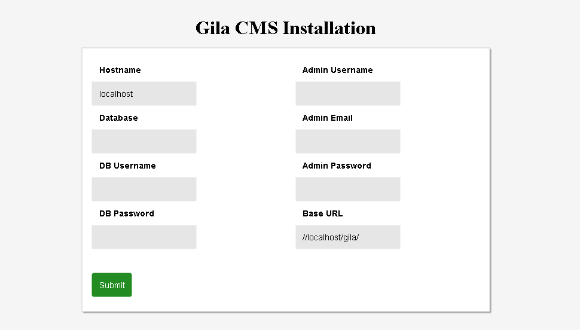
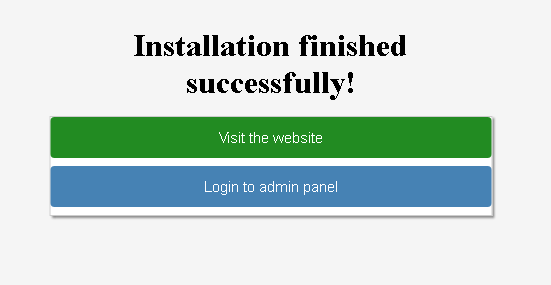
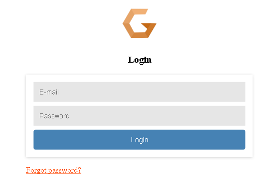
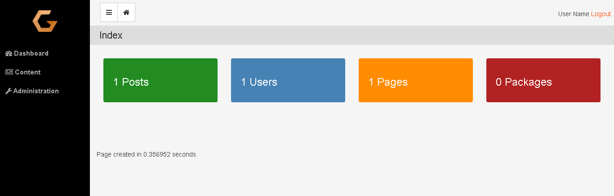

# Installation

### Preparation

Before beginning with installation make sure that your web host or local server meets these requirements:

- Apache 2/ Nginx server
- MySQL / MariaDB server
- PHP 7.0+ with the following extensions *mysqli, zip, mysqlnd, json, gd* and *mod_rewrite* enabled

If you want to install gila cms in your local machine and not sure how to prepare your server don't hesitate to ask for help on [Slack](https://gilacms.slack.com)

First unzip gila in a public html folder e.g */var/www/html/gila* and make sure that the folder is writable from the application.

On **nginx** server you will need to configure the redirects in */etc/nginx/sites-enabled/default* [(issue #1)](https://github.com/GilaCMS/gila/issues/1)
```
location / {
    index index.php index.html index.htm;
    rewrite gila/(?!install)(?!src)(?!themes)(?!lib)(?!assets)(?!tmp)(?!robots.txt)(.*)$ /gila/index.php?url=$1 last;
}
```

On **apache 2** server you may need to edit default VirtualHost file in order let .htaccess work. On ubuntu/debian you run
```
sudo nano /etc/apache2/sites-available/000-default.conf
```
And add these lines after *DocumentRoot /var/www/html*
```
<Directory "/var/www/html">
    AllowOverride All
</Directory>
```
If you need to activate mod_rewrite for apache
```
sudo a2enmod rewrite
```

Don't forget to restart your server if you made any changes.

In order to proceed with the installation, you will need your **database settings**. If you do not know your database settings, please contact your host and ask for them. You will not be able to continue without them. More precisely you need the database hostname, the database name, the database username and password.

<br>
### Installer

We access in installation page with the browser e.g *http:\/\/localhost/gila/install*



In the installation page we must fill all the fields

- **Hostname:** the hostname of the database, usually it is *localhost*

- **Database:** name of the database

- **DB Username, DB Password:** the username and the password in order to connect to the mysql

- **Admin Username, Admin Email, Admin Password:** a user will be created for the website as administrator with these data

- **Base Url:** the web address of the website must finish with '/' e.g. *mywebsite.com/*


After filling the data and submit them, we wait a few seconds untill the installation is finished.



When installation is finished we can enter on the admin panel using the admin email and password that we wrote before.



We can always access in the login page from these links
*mysite.com/* **/login** it redirects to the front page of the website
*mysite.com/* **/admin** it redirects to the administration

We enter in the administration dashboard.



On the administration menu we see two submenus
- **Content** to add or edit content like pages, posts or files
- **Administration** to edit users or change the settings of the website.
