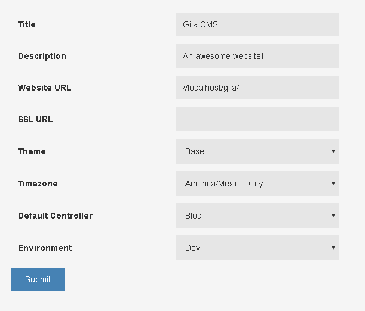

# Installation

### Prequesites

Before beginning with installation make sure that your server meets these requirements:

- Apache 2 server
- MySQL server
- PHP 5.4+ with the following extensions *mysqli, zip, mysqlnd, json* and *mod_rewrite* enabled

If you are not sure how to prepare your server don't hesitate to ask for help on [Slack](https://gilacms.slack.com)

### Preparing for installation

1. First we create a new database in mysql and a user with all privileges in that schema.

2. We unzip gila in a public html folder e.g */var/www/html/gila* and make sure that the folder is writable from the application

3. We access in installation with the browser e.g *http://localhost/gila/install*

In the installation page we must fill all the fields

**Hostname:** the host name of the database, usually it is *localhost*

**Database:** name of the database for the website

**DB Username, DB Password:** the username and the password in order to connect to the mysql

**Admin Username, Admin Email, Admin Password:** a user will be created for the website as administrator with these data

**Base Url:** the web address of the website must finish with '/' e.g. *mywebsite.com/*

After filling the data and submit them, we wait a few seconds untill the installation is finished.

When installation is finished we can enter on the admin panel using the admin email and password that we wrote before.

We can always access in the login page from these links
- **/login** it redirects in the front page of the website
- **/admin** it redirects in the administration

We enter in the administration dashboard.

From the administation menu we choose Administration->Settings in order to fill more information about the website.

